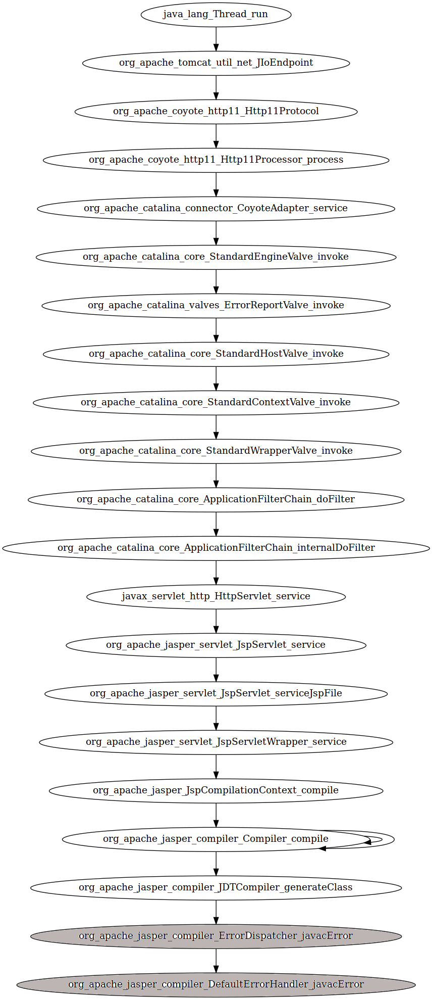
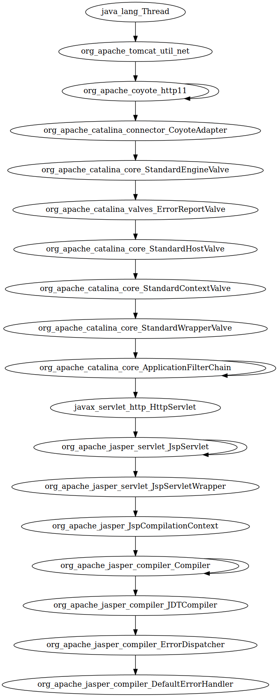

% Assignment 3:\newline Untersuchung der Architektur von Tomcat 6.0.53
% Autoren: Felix Hefner, Max Jando, Severin Kohler
% Stand: 12.10.2017

# Einleitung

Im Rahmen der Vorlesung LSD (Large-Scale-Development)
sollten die Autoren dieses Dokuments,
die Architektur von Tomcat genauer untersuchen.
Da die gesamte Analyse von Tomcat 6.0.53 zu 
umfangreich für die Vorlesung wäre, beschränkt sich 
diese Analyse auf die Beziehungen der Pakete beim 
Aufruf eines Requests an den Tomcat. 
 
# Architektur von Tomcat

