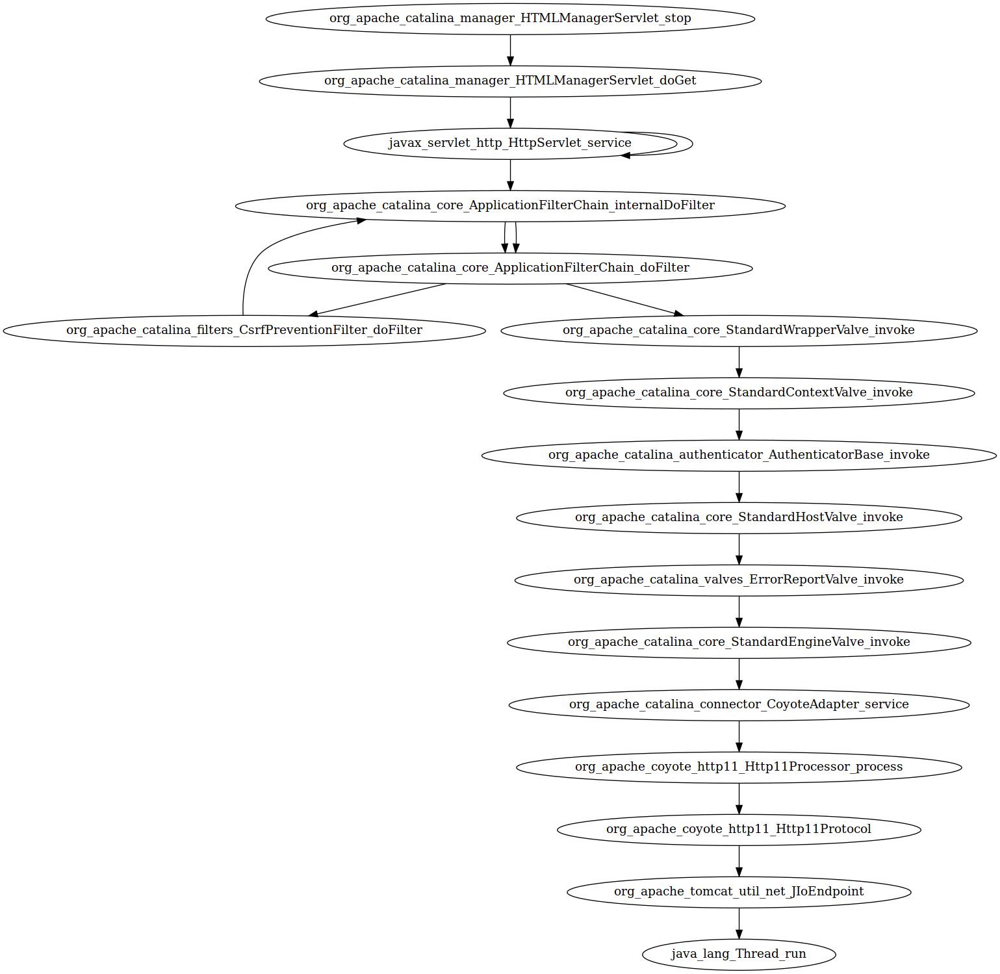

% Large-Scale Development (LSD) \newline Assignment 3: Untersuchung der Architektur von Tomcat 6.0.53
% Autoren: Felix Hefner, Max Jando, Severin Kohler
% Stand: 12.10.2017

# Einleitung

Im Rahmen der Vorlesung LSD (Large-Scale-Development) sollten die Autoren dieses Dokuments, die Architektur von Tomcat genauer untersuchen. Da die gesamte Analyse von Tomcat 6.0.53 zu umfangreich für die Vorlesung wäre, beschränkt sich diese Analyse auf die Beziehungen der Pakete beim Aufruf eines Requests an den Tomcat. 

# Vorgehen

Um die Architektur zu untersuchen, haben wir uns sowohl auf die statische Struktur und die Abhängigkeiten zwischen den Paketen als auch auf das dynamische Verhalten des Systems während der Laufzeit fokusiert.

## Statische Analyse

Folgende Schritte wurden bei der statischen Analyse ausgeführt:

1. Mit dem Linux-Tool `grep` durch alle Dateien des Source-Codes iterieren und nach dem Schlüsselwort *import* suchen.
2. Die Ergebnisse mittels `sed` in ein geeignetes Format bringen, letztendlich $Klasse_a \rightarrow Klasse_b, die Klasse_a$ importiert
3. Mit weiteren `grep`-Ausführungen nach bestimmten Paketen filtern bzw. nach allen Paketen, die **nicht** (`grep -v`) den Kriterien entsprechen.
4. Alle bisherigen Ausgaben in eine `.dot`-Datei umleiten und mit dem Header `digraph {` und einer schließenden Klammer versehen, um sie für das Tool `dot` von Graphviz[^1] vorzubereiten.
5. `dot -Dpng input.dot output.png` ausführen, um einen Abhängigkeitsgraphen als .png zu erstellen.

## Dynamische Analyse

Um das Verhalten von Tomcat während der Laufzeit zu untersuchen, haben wir zunächst ein paar Vorbereitungen durch Modifizierung des Codes vorgenommen. Wie wir aus der folgenden Abbildung entnehmen konnten, ist offenbar das Paket *org.catalina.connector* wichtig für Tomcat und hängt mit vielen anderen Paketen zusammen. 


Deswegen haben wir zunächst untersucht. Innerhalb des Paketes in der Klasse *Connector* haben wir uns mit einem Iterator sämtliche Bohnen, die während der Laufzeit existieren, ausgegeben. Die auffälligste Bohne `RequestDumperValve` haben wir uns anschließend genauer angeschaut. Da die `RequestDumperValve` bei der Funktion *invoke()* eine ServletException schmeißen kann, haben wir uns ein spezielles Servlet rausgesucht und näher betrachtet. Hierfür haben wir auf dem Web-Interface von Tomcat unter [localhost:8080/](http://localhost:8080/) den Servlet-Manager aufgerufen und bei einem Servlet auf den Stop-Link geklickt, wodurch die Stop-Funktion des *HTTPManagerServlet* aufgerufen wurde (siehe Abbildung \ref{servlet_manager}). Da wir außerdem die Aufrufhierarchie bei der Anfrage eines Benutzer-eigenen Java Server Pages(JSP)-Files untersuchen wollten, haben wir ein kleines JSP erstellt und in den Java-Teil das Werfen einer Exception eingebaut, welche den Stacktrace ausgibt. Das folgende Listing zeigt dieses.

\newpage

[^1]: [www.graphviz.org](http://www.graphviz.org/)

```html
<html><body>
Es ist:
<% out.println((new java.util.Date()).toString());

    try {
        throw new Exception();
    } catch (Exception e) {
        e.printStackTrace();
    }
};
%>

</body></html>
```

Listing 1: Einfaches Servlet, in das eine Exception eingebaut wurde.
 
# Architektur von Tomcat

Die folgenden Abhängigkeitsgraphen zeigen die Ergebnisse unserer dynamischen Architektur-Untersuchungen. Sie wurden mit dem Tool  `dot` aus Graphviz gezeichnet.



{width=95%}

\newpage

# Probleme

Während der Bearbeitung dieses Assignments ergaben sich unter anderem aufgrund der relativ weit gefassten Aufgabenstellung ein paar Probleme:

- Die generierten Graphen wurden schnell sehr komplex und zu unübersichtlich, sodass man sich auf die relevanten Teile fokusieren muss 
- Wichtige Klassen als Einstiegspunkte für weitere Untersuchungen zu identifizieren bei solch einem komplexen Softwareprojekt ist nicht trivial.
- Bei der Aufbereitung der Ergebnisse mussten manche ausgeführten Schritte rekonstruiert werden, da nicht direkt während der Untersuchungen alles dokumentiert wurde.
