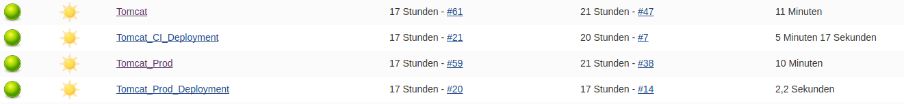
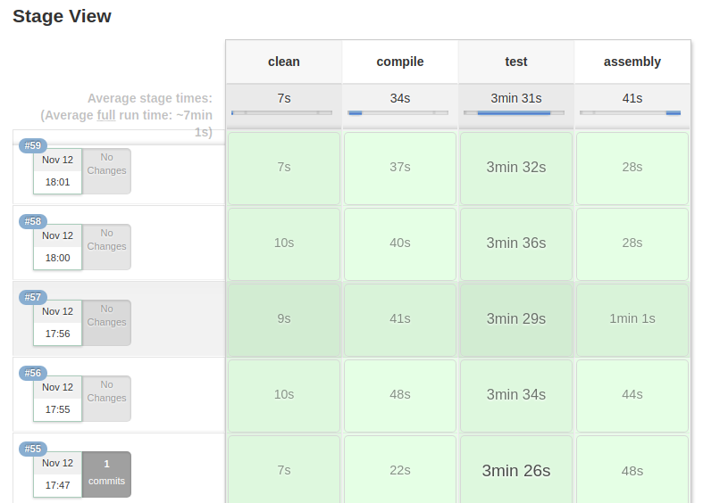
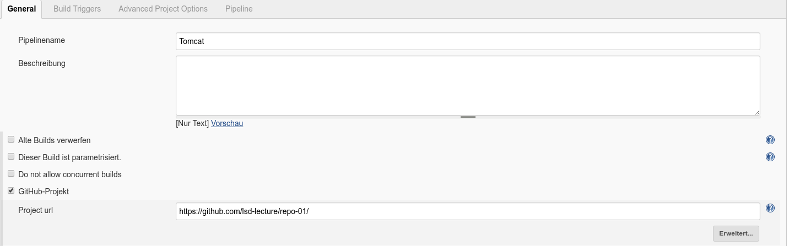
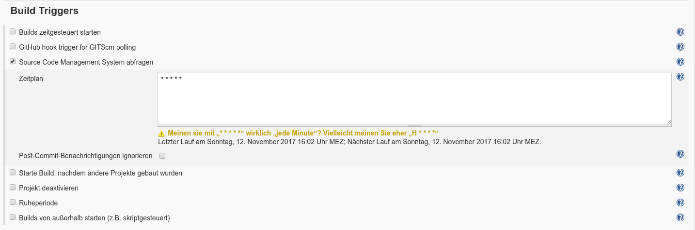
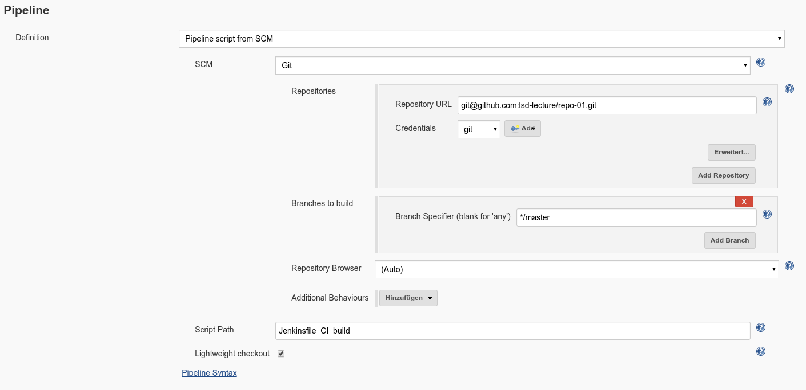
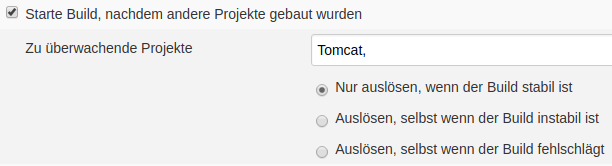

% Large-Scale Development (LSD) \newline Assignment 5: Der Build-Server *Jenkins*
% Autoren: Felix Hefner, Max Jando, Severin Kohler
% Stand: \today{}

# Einleitung

Im Rahmen der Vorlesung LSD (Large-Scale-Development) sollten die Autoren dieses Dokuments den Opensource-Build-Server *Jenkins* aufsetzen und eine Build-Pipeline anlegen, welche den in vorherigen Assignments bereits behandelten Tomcat 6.0.5 baut. Dieses Dokument ist in folgende Teile untergliedert:

1. Installation von Jenkins auf einem Ubuntu-Server
2. Konfiguration der Build-Jobs in Jenkins
	1. Erstellung der Jenkinsfiles
	2. Weitere Konfiguration auf der Weboberfläche von Jenkins

# Installation von Jenkins auf einem Ubuntu-Server

Da das Ubuntu Server-Betriebssystem mit der Paketverwaltung \texttt{apt-get} ausgeliefert wird, konnte diese auf relativ simple Weise dazu benutzt werden, das Jenkins-Paket zu installieren. Jedoch war dieses nicht in den Standard-Paketquellen zu finden, sodass eine spezielle Quelle von den Entwicklern der Software hinzugefügt werden musste. Im Großen und Ganzen wurde sich hierbei an die offizielle Anleitung[^1] gehalten. Genauer wurde wie folgt vorgegangen:

1. Manuelles Hinzufügen des Publickeys der Jenkins.io - Server, damit diesem vertraut wird
2. Hinzufügen der Jenkins-Paketquelle durch
```bash
sudo sh -c 'echo deb http://pkg.jenkins.io/debian-stable
binary/ > /etc/apt/sources.list.d/jenkins.list'
```
3. Aktualisieren der Paketquellen sowie Installation des Pakets durch
```bash
sudo apt-get update ; sudo apt-get install jenkins
```
4. Da der Paketmanager nach der Installation von selbst den Befehl \texttt{service start jenkins} aufruft, läuft Jenkins ab sofort unter \texttt{http://<IP-des-Servers>:8080}.

[^1]: [https://wiki.jenkins.io/display/JENKINS/Installing+Jenkins+on+Ubuntu](https://wiki.jenkins.io/display/JENKINS/Installing+Jenkins+on+Ubuntu)

# Konfiguration der Build-Jobs in Jenkins

Die Build-Jobs, die in Jenkins zum Kompilieren des Java-Codes, zum Ausführen der Tests sowie zum Deployen des fertigen \texttt{.jar}-Archivs verwendet werden, wurden primär über sogenannte *Pipelines* anhand von *Jenkinsfiles* erstellt. Hierbei handelt es sich um Scripte, welche in der Sprache Groovy geschrieben werden und sich in Stages unterteilen. 
Stages unterteilen den Build-Vorgang in Abschnitte, um so Aufgaben, die während des Build-Prozesses anfallen besser zu unterteilen.
So könnten z.\, B. die Aufgaben für das Bereinigen[^2] der Arbeitsumgebung, oder das Kompilieren[^3] des Codes in separaten Stages ausgeführt werden.
Treten nun Fehler während des Build-Prozesses auf, ist es einfacher die Stelle zu lokalisieren an welchem der  Fehler aufgetreten ist.
Alle Stages, die definiert werden, sind beim Ausführen des Jenkins-Pipeline-Job auch auf der Weboberfläche sichtbar um somit den momnentanen Stand des Build-Vorgangs zu sehen. 
Der Inhalt des \texttt{Jenkinsfile} wurde zunächst direkt in der Weboberfläche eingetragen, nach dem ersten Build-Durchlauf konnte jedoch diese Datei 
aus dem Github-Repository heruntergeladen werden und anschließend von dort verwendet werden. 
Insgesamt wurden mehrere Build-Jobs für folgende Zwecke erstellt, damit die Aufgaben strikt getrennt sind:

[^2]: engl. clean
[^3]: engl. compile

- **Tomcat_CI_Build:** Jenkins-Job zum Kompilieren des Sourcecodes, Testens und erstellen einer \texttt{.jar}-Datei.
- **Tomcat_CI_Deployment:** Deployment (kopieren des \texttt{.jar}-Files an eine definierte stellen sowie beenden des alten Tomcat-Prozesses und starten eines neuen) der Ergebnisse von **Jenkins**.
- **Tomcat_Prod_Build:** Siehe **Tomcat_CI_Build**, lediglich ein weiterer Build, um eventuelle Auslieferung (Production) anbieten zu können, ohne die Entwicklung im CI-Build zu beeinflussen. Dieser Build wird erst gebaut, sobald der CI-Build erfolgreich war.
- **Tomcat_Prod_Deployment:** Analog zu **Tomcat_CI_Deployment**

## Erstellung der Jenkinsfiles

Das folgende Listing zeigt eines der erstellten Jenkinsfiles, welches für dieses Projekt benutzt wurde. Es handelt sich um die Datei \texttt{Jenkinsfile\_CI\_build}, welche für den ersten Build-Job **Jenkins_CI_Build** benutzt wird. Das Script für **Jenkins_Prod_Build** fällt identisch aus. Es wurde jedoch an einem separatem Pfad abgelegt, um es zukünftig leichter austauschen zu können.

~~~{.groovy .numberLines stepnumber=6 captionpos=b, caption="Jenkinsfile zum Compilieren, Testen und Packen von Tomcat mit Maven"}
pipeline {
	agent any
	stages {
		stage('clean') {
			environment { 
                JAVA_HOME = "/usr/lib/jvm/java-8-openjdk-amd64"
                PATH = "${env.JAVA_HOME}/bin:${env.PATH}"
            }
			steps {
				checkout scm
				sh "cd 'tomcat' ; mvn 'clean'"
			}
		}
		stage('compile') {
			steps {
				sh "cd 'tomcat' ; mvn 'compile'"
			}
		}
		stage('test') {
			steps {
				sh "cd 'tomcat' ; mvn test"
			}
		}
		stage('assembly') {
			steps {
				sh "cd 'tomcat' ; mvn clean compile assembly:single"
			}
		}
	}
}
~~~
Dieses Script ist in die vier Stages *clean*, *compile*, *test* und *assembly* aufgeteilt. In *clean* wird das in Jenkins angegebene SCM[^4] ausgecheckt, die Umgebungsvariablen \texttt{JAVA\_HOME} und \texttt{JAVA\_PATH} gesetzt sowie \texttt{mvn clean} ausgeführt, was die zuvor Kompilierten Dateien löscht. In *compile* wird das gleichnamige Maven-Target aufgerufen, welches den Java-Sourcecode kompiliert. In *test* werden analog dazu mit Maven die Tests ausgeführt. Abschließend wird in *assembly* der Befehl \texttt{mvn assembly:single} auf die Shell gegeben, welcher eine ausführbare \texttt{.jar}-Datei erstellt.

[^4]: Source Code Management

Die Jenkinsfile für das Deployment (CI und PROD) fallen deutlich kürzer aus:

~~~{.groovy .numberLines stepnumber=6 captionpos=b, caption="Jenkinsfile zum Verbreiten von Tomcat mit Maven"}
pipeline {
	agent any
	stages {
		stage('killing_tomcat_process') {
			steps {
				sh '/var/lib/jenkins/kill_tomcat.sh CI'
			}
		}
		stage('copying_files') {
			steps {
				sh 'cp "/var/lib/jenkins/workspace/Tomcat/tomcat/target/tomcat-6.0.5-jar-with-dependencies.jar" "/var/lib/jenkins/tomcat-6.0.5-CI.jar"'
			}
		}
		stage('starting_tomcat') {
			steps {
				sh 'cd "/var/lib/jenkins" ; nohup java -jar tomcat-6.0.5-CI.jar &'
			}
		}
	}
}
~~~
Zunächst wird in der Stage *killing_tomcat_process* mit einem kleinen selbstgeschriebenen Script[^5] 
bei Bedarf der aktuell laufende Tomcat-Prozess beendet. Danach wird das zuvor erzeugte Java-Archiv 
an die vorgesehene Stelle kopiert. Zuletzt wird dieses mithilfe des Befehls \texttt{nohup}, 
welcher die Ausgabe eines Befehls in eine Log-Datei umleitet, 
im Hintergrund (durch Verwendung von **&** am Ende des Befehls) gestartet. 
Hierbei ist noch zu erwähnen, dass die .jar und somit der Tomcat nicht startet, insofern 
im selben Verzeichnis nicht die Unterverzeichnisse \texttt{conf} und \texttt{webapps} 
liegen und mit entsprechendem Inhalt gefüllt sind. Ersteres Verzeichnis enhält ein paar 
Konfiguration zu Tomcat im \texttt{.xml}-Format[^6], letzteres den Benutzerinhalt wie Servlets und JSPs.

[^5]: Dieses kann hier bei Github gefunden werden: [Script \texttt{kill\_tomcat.sh} auf Github](https://github.com/lsd-lecture/repo-01/blob/master/kill_tomcat.sh)
[^6]: Hier musste zudem die Datei \texttt{server.xml} bearbeitet werden, um den Standardport *8080* von Tomcat auf *8081* zu ändern, da hier ja bereits der Jenkins läuft.

## Weitere Konfiguration auf der Weboberfläche von Jenkins

Im folgenden werden Schritt für Schritt sämtliche Einstellungen, die wir für die von uns 
angelegten Jenkins-Pipelines getätgit haben, anhand von Screenshots gezeigt und anschließend 
genauer erläutert.

Die nachstehende Abbildung zeigt sämtliche Jobs die wir in Jenkins angelegt haben. 
Die Ampellichter geben an, ob der Build erfolgreich war[^7]. Das Wetter gibt den durchschnittliche 
erfolgsrate der letzten 5 builds an je schlechter das Wetter desto mehr Fehlschläge gab es [^8]. 




[^7]: Grün=Erfolg, Rot=Fehlschlag, Grau=Geplant, aber noch nicht gestartet
[^8]: [https://wiki.jenkins.io/display/JENKINS/Dashboard+View](https://wiki.jenkins.io/display/JENKINS/Dashboard+View)

In der folgenden Übersicht, welche in Jenkins *Stage View* genannt wird, sind die einzelnen Build Prozesse (stages) des **Tomcat**-Jobs aufgeführt, sowie ob diese Erfolgreich waren und wie lange sie gebraucht haben. Außerdem wird  die durschnittliche Zeit der Stages angezeigt. 





\newpage{}

Hier wird der Name der Pipeline (**Tomcat**) angegeben und welche Art von Projekt (Github-Project) 
dies ist. Im Zusammenhang dazu muss die URL des Repositories angegeben werden von dem dann gebaut wird. 



Mit diesem Parameter wird angegeben in welchen Intervallen überprüft werden soll ob Änderungen 
im Git-repository stattgefunden haben. In unserem Fall wird dies jede Minute überprüft. 
Wie Cron-Zeitangaben angegeben werden ist hier[^9] erläutert. 
Liegen Änderungen vor werden diese vom Repostory geholt und anschließend gebaut.

\newpage{}

[^9]: [https://help.ubuntu.com/community/CronHowto](https://help.ubuntu.com/community/CronHowto)



Wie in Abb. 5 zu sehen, werden die Credentials[^10] des Git-Projektes ausgefüllt um sich bei Github zu Authentifizieren. 
Des Weiteren muss der Git-Branch spezifiziert werden. Als letztes haben wir den Pfad zum Pipeline-Skript angegeben (Jenkinsfile_CI_build)

[^10]: Username und der bei Github hinterlegte Public-Key 



Manche unserer Jenkins-Jobs, nämlich die beiden für das
Deployment, sind abhängig von den Build-Jobs, da nur 
eine neue Version veröffentlicht wird, wenn es erfolgreich 
gebaut wurde. Deshalb haben wir beispielsweise bestimmt, 
dass der **Tomcat-CI-Deployment**-Job erst dann ausgeführt wird,
 wenn der **Tomcat-CI-Build**-Job erfolgreich abgeschlossen wurde.

# Ausblick und weitere Konfigurationen

In den vergangenen Kapiteln wurde eine Möglichkeit gezeigt, ein größeres Sofware-Projekt (in unserem Fall Tomcat)
automatisiert zu Bauen und im erfolgreichen Fall auch zu Veröffentlichen. Um eine reibungslose Entwicklung, getrennt 
vom Live-Betrieb der Software zu gewährleisten, wurden verschiedene Umgebungen (CI, PROD) definiert. 
Aufgrund des zeitlichen Rahmens, konnten nicht alle von gewünschten Tätigkeiten zur noch besseren Automatisierung und
Dokumentation des Software-Projekts durchgeführt werden. Im folgenden sollen die noch offenen Aufgaben kurz dargestellt werden.

## Deployment-Automatisation mittels Ansible-Playbooks

In unserer vorgestellten Pipeline für das Deployment der Artefakte für die Umgebungen CI und PROD, wurde mithilfe
von Scripts das Deployment durchgeführt. Diese Scripts funktionieren zwar, jedoch bieten Sie wenig Möglichkeiten der
Konfiguration und liefern keine Übersicht über veröffentlichte Anwendungen.  
Die Firma Red Hat bietet eine Software an, um Artefakte (war, jar) automasiert zu deployen und eine Übersicht über
alle deployten Anwendungen zu erhalten.

## Anhängen des Git-Commit-Hashes an den Artefaktnamen

In unserer Konfiguration wird der Tomcat stets in der Version 6.0.5 gebaut und veröffentlicht. 
Ein Hochsetzen der Version für kleinere und größere Änderungen müsste somit manuell durchgeführt werden.
Da kleine Änderungen in Software-Projekten sehr oft durchgeführt werden, ist dieses Vorgehen sehr aufwendig,
da im Vorfeld erst geklärt werden muss, was "kleine" und was "große" Änderungen sind. Ein Vorschlag für die
Versionierung ist die Entfernung der letzten beiden Stellen. Ersetzt werden diese Stellen durch den Git-Commit-Hash,
der den Build angestoßen hat. So erhält man einen direkten Bezug der gebauten .jar-File zu der Änderung, 
die im Code durchgeführt wurde. Realisiert werden könnte der Einbau des Hashes in den Dateinamen über ein maven-Plugin,
mit welchem sich Tasks (wie z.\, B. assembly) manupilieren lasst um somit einen selbst definierten Namen zu setzen.

## Archivierung der Artefakte in ein Archiv

Alle Artefakte die als CI, oder PROD veröffentlicht werden, sind nach dem Veröffentlichen nicht gespeichert.
Hiermit ist gemeint, das Artefakte nach dem Bauen, lediglich in einen Ordner verschoben werden und ggf. Überschrieben
werden, sollte sich die Version des Artefakts nicht erhöht haben. Von Vorteil wäre es, wenn die erfolgreich gebauten CI-Artefakte
und je nach Anwendungsfall auch die gebauten PROD-Artefakte automatisiert archiviert werden um somit einen besseren Überblick 
über alle gebauten Artekfate zu erhalten. Hierzu könnte z.\B. die quelloffene Software \textit{Archiva} der Apache Software Foundation genutzt werden.
Dieses Programm ist ein Webserver, an welchen Artefakte übergeben werden können um diese zu archivieren.   


